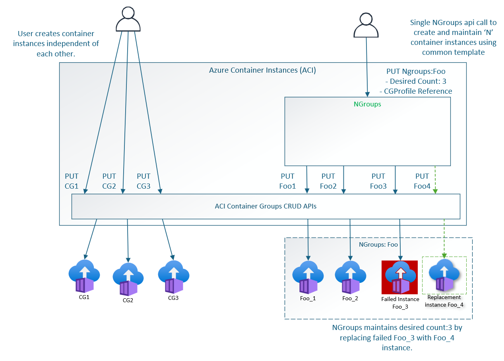

# Azure Container Instance - Workshop

## Menú

- [Conceptos Base](#conceptos-base)
- [Tipo de despliegues en Azure Container Instance](#tipo-de-despliegues-en-azure-container-instance)
    - [Container Groups](#container-groups)
    - [Despliegue de container Groups](#despliegue-de-container-groups)
        - [Despliegue de Container Group usando ARM Templates](#despliegue-de-container-group-usando-arm-templates)
            - [Configuración de plantilla](#configuración-de-plantilla)
            - [Desplegar la plantilla ARM](#desplegar-la-plantilla-arm)
            - [Ver los registros del contenedor (ARM)](#ver-los-registros-del-contenedor-arm)
        - [Despliegue de Container Group usando archivos YAML](#despliegue-de-container-group-usando-archivos-yaml)
            - [Desplegar el grupo de contenedores](#desplegar-el-grupo-de-contenedores)
            - [Estado del despliegue](#estado-del-despliegue)
            - [Ver los registros del contenedor (YAML)](#ver-los-registros-del-contenedor-yaml)

## Conceptos Base
### ¿Que es Azure Container Instance?

Azure Container Instances (ACI)es un servicio serverless que permite empaquetar, desplegar y gestionar servicios contenerizados sin tener que administrar la infraestructura subyacente. Entre los escenarios comunes que se ejecutan en ACI se incluyen:

- Desarrollo y pruebas de servicios
- Ejecucion de tareas por lotes
- Desplegar aplicaciones de corta duración.
- Automatización de tareas.

Puedes utilizar ACI definiendo los recursos que necesita cada **Container Group**, incluyendo vCPU y memoria. 

ACI es compatible con contenedores del estandar abierto o **Container Group**, soporte a **Container Group** en infraestructuras confidenciales o **Confidential Container Group** y **Spot**. ACI soporta una instancia única o de múltiples instancias mediante **NGroups**, o bien se pueden obtener mayores capacidades de orquestación desplegando pods en tu clúster de **Azure Kubernetes Service (AKS)** a través de **nodos virtuales en ACI**. Para mejorar los tiempos de inicio de los containers, ACI soporta **standby pools.**

### Azure Container Instance Availability zone

Azure Container Instances soporta despliegues zonales para container groups, lo que significa que cada grupo se asigna a una zona de disponibilidad específica. No es posible que un único container group abarque múltiples zonas. Si necesitas cambiar la zona de un container group, deberás eliminarlo y recrearlo en la nueva zona. Para lograr alta disponibilidad a nivel de zona, se recomienda desplegar múltiples container groups en diferentes zonas.

Para poder implementarlo debes contar con:
- Azure CLI 2.30.0 o superior.
- Azure Resource Manager Api 09-01-2021 o superior.

### Soporte para failover zonal

Un grupo de contenedores (container group) se asigna a una única zona de disponibilidad. Como resultado, ese grupo de instancias de contenedores no se verá afectado por una interrupción que ocurra en cualquier otra zona de la misma región.

Sin embargo, si se produce una interrupción en la zona de disponibilidad en la que se encuentra el grupo de contenedores, se espera que todas las instancias dentro de ese grupo experimenten tiempo de inactividad.

Para evitar el tiempo de inactividad de las instancias de contenedores, se recomienda crear un mínimo de dos grupos de contenedores distribuidos en dos zonas de disponibilidad diferentes dentro de una misma región. Esto garantiza que los recursos de contenedores estén operativos siempre que alguna zona en esa región sufra una interrupción.

### Recuperación ante desastres

Cuando una región o centro de datos completo de Azure experimenta tiempo de inactividad, tus servicios mas críticos deben continuar ejecutándose en una región diferente. Las instancias de Azure Container Instances desplegadas con configuración zonal se ejecutan en una zona específica dentro de una región determinada, sin contar con redundancia incorporada. Para evitar la pérdida de ejecución durante fallos a nivel de región, se recomienda desplegar las instancias de contenedores de forma redundante en otras regiones.

## Tipo de despliegues en Azure Container Instance

## Container Groups:

Un **Container Group** es un conjunto de contenedores que se ejecutan en la misma máquina virtual. Los contenedores en un grupo comparten el ciclo de vida, los recursos, la red local y los volúmenes de almacenamiento. Es similar en concepto a un pod en Kubernetes.

El siguiente diagrama muestra un ejemplo de un grupo de contenedores que incluye múltiples contenedores:


Este grupo de contenedores de ejemplo:
- Se aprovisiono en una única máquina virtual.
- Se le asigna un registro de nombre DNS.
- Expone una única dirección IP pública y expone un puerto especifico.
- Consta de dos contenedores. Un contenedor escucha en el puerto 80, mientras que el otro escucha en el puerto 5000.
- Incluye dos volumes de tipo **Azure Files** como montajes de volúmenes, y cada contenedor monta localmente una de estas comparticiones.

**Nota:**
- Los grupos de contenedores múltiples actualmente solo estan soportados para contenedores Linux.
- Para contenedores de Windows, Azure Container Instances solo soporta el despliegue de una única instancia de contenedor. 


## Despliegue de container Groups

Existen dos formas de desplegar un grupo de contenedores múltiples: 
1. Usar una plantilla de Resource Manager 
2. Usar un archivo YAML. 

Se recomienda utilizar una plantilla de Resource Manager (ARM) cuando necesites desplegar otros recursos de servicios de Azure (containers no efimeros, los cuales requieren almacenamiento externo) al desplegar las instancias de contenedores. Debido a la naturaleza más concisa del formato YAML, se recomienda un archivo YAML cuando tu despliegue incluye únicamente instancias de contenedores. Para más detalles sobre las propiedades que puedes configurar, consulta la referencia de la plantilla de Resource Manager o la documentación de referencia YAML.

Para preservar la configuración de un grupo de contenedores, puedes exportar la configuración a un archivo YAML utilizando el comando de Azure CLI az container export. La exportación te permite almacenar las configuraciones de tu grupo de contenedores en un sistema de control de versiones para “configuración como código”, o bien utilizar el archivo exportado como punto de partida para desarrollar una nueva configuración en YAML.

## Despliegue de Container Group usando ARM Templates

**Requisitos previos:**
- Utiliza el entorno Bash en Azure Cloud Shell.
- Si prefieres ejecutar los comandos de referencia de la CLI localmente, instala la Azure CLI. Ejecuta **az version** para conocer la versión y las bibliotecas dependientes instaladas. 
- Inicia sesión en la Azure CLI utilizando el comando az login.

## Configuracion de plantilla

```bash
touch azuredeploy.json
```

2.	Esta plantilla de Resource Manager define un grupo de contenedores con dos contenedores, una dirección IP pública y dos puertos expuestos. El primer contenedor del grupo ejecuta una aplicación web orientada a Internet. El segundo contenedor, el sidecar, realiza una solicitud HTTP a la aplicación web principal a través de la red local del grupo.

```bash
code azuredeploy.json

{
  "$schema": "https://schema.management.azure.com/schemas/2015-01-01/deploymentTemplate.json#",
  "contentVersion": "1.0.0.0",
  "parameters": {
    "containerGroupName": {
      "type": "string",
      "defaultValue": "myContainerGroup",
      "metadata": {
        "description": "Nombre del grupo de contenedores."
      }
    },
    "restartPolicy": {
      "type": "string",
      "defaultValue": "OnFailure",
      "allowedValues": [
        "Always",
        "OnFailure",
        "Never"
      ],
      "metadata": {
        "description": "Política de reinicio para el grupo de contenedores."
      }
    },
    "availabilityZone": {
      "type": "string",
      "defaultValue": "1",
      "metadata": {
        "description": "Zona de disponibilidad en la que se desplegará el grupo de contenedores."
      }
    }
  },
  "variables": {
    "container1name": "aci-tutorial-app",
    "container1image": "mcr.microsoft.com/azuredocs/aci-helloworld:latest"
  },
  "resources": [
    {
      "name": "[parameters('containerGroupName')]",
      "type": "Microsoft.ContainerInstance/containerGroups",
      "apiVersion": "2023-05-01",
      "location": "[resourceGroup().location]",
      "zones": [
        "[parameters('availabilityZone')]"
      ],
      "properties": {
        "restartPolicy": "[parameters('restartPolicy')]",
        "containers": [
          {
            "name": "[variables('container1name')]",
            "properties": {
              "image": "[variables('container1image')]",
              "resources": {
                "requests": {
                  "cpu": 1,
                  "memoryInGb": 1.5
                }
              },
              "ports": [
                {
                  "port": 80
                },
                {
                  "port": 8080
                }
              ]
            }
          }
        ],
        "osType": "Linux",
        "ipAddress": {
          "type": "Public",
          "ports": [
            {
              "protocol": "tcp",
              "port": 80
            },
            {
              "protocol": "tcp",
              "port": 8080
            }
          ]
        }
      }
    }
  ],
  "outputs": {
    "containerIPv4Address": {
      "type": "string",
      "value": "[reference(resourceId('Microsoft.ContainerInstance/containerGroups/', parameters('containerGroupName'))).ipAddress.ip]"
    }
  }
}
```

Nota: Si quisieramos usar un registry privado tendriamos que agregar:

```json
"imageRegistryCredentials": [
  {
    "server": "[parameters('imageRegistryLoginServer')]",
    "username": "[parameters('imageRegistryUsername')]",
    "password": "[parameters('imageRegistryPassword')]"
  }
]
```

## Desplegar la plantilla ARM

1.	Crea un grupo de recursos con el comando az group create:
    ```bash
    az group create --name myResourceGroup --location eastus
    ```

2.	Despliega la plantilla utilizando el comando az deployment group create:
    ```bash 
    az deployment group create --resource-group myResourceGroup --template-file azuredeploy.json
    ```

3. Para ver el estado del despliegue, utiliza el siguiente comando:

    ```bash
    az container show --resource-group myResourceGroup --name myContainerGroup --output table
    ```

nota:
Si deseas ver la aplicación en ejecución, navega a la dirección IP asignada en tu navegador. Por ejemplo, en la salida de este ejemplo la IP es 52.168.26.124:

## Ver los registros del contenedor

Para ver la salida de los registros de un contenedor, utiliza el comando az container logs. El argumento --container-name especifica el contenedor del cual se extraerán los registros. En este ejemplo, se especifica el contenedor aci-tutorial-app:

Realizamos un request
```bash
export CONTAINER_INSTANCE_IP=$(az container show --resource-group myResourceGroup --name myContainerGroup --query "ipAddress.ip" --output tsv)
curl $CONTAINER_INSTANCE_IP
```
Para ver los registros del contenedor, ejecuta un comando similar especificando el contenedor aci-tutorial-sidecar:

```bash
az container logs --resource-group myResourceGroup --name myContainerGroup --container-name aci-tutorial-app
```

Salida:
```bash
listening on port 80
::ffff:10.92.0.5 - - [17/Mar/2025:18:12:43 +0000] "GET / HTTP/1.1" 200 1696 "-" "Mozilla/5.0 (Macintosh; Intel Mac OS X 10_15_7) AppleWebKit/537.36 (KHTML, like Gecko) Chrome/134.0.0.0 Safari/537.36"
::ffff:10.92.0.5 - - [17/Mar/2025:18:12:45 +0000] "GET /favicon.ico HTTP/1.1" 404 150 "http://20.124.151.194/" "Mozilla/5.0 (Macintosh; Intel Mac OS X 10_15_7) AppleWebKit/537.36 (KHTML, like Gecko) Chrome/134.0.0.0 Safari/537.36"
::ffff:10.92.0.6 - - [17/Mar/2025:18:17:04 +0000] "GET / HTTP/1.1" 200 1696 "-" "curl/8.7.1"
```

Para relizar llamadas petetitivas cada 3 segundos al container instance
Salida:
```bash
while true; do curl -I $CONTAINER_INSTANCE_IP ; echo ""; sleep 3; done      

HTTP/1.1 200 OK
X-Powered-By: Express
Accept-Ranges: bytes
Cache-Control: public, max-age=0
Last-Modified: Mon, 21 Oct 2024 12:17:29 GMT
ETag: W/"6a0-192af02cba8"
Content-Type: text/html; charset=UTF-8
Content-Length: 1696
Date: Mon, 17 Mar 2025 18:20:07 GMT
Connection: keep-alive
Keep-Alive: timeout=5
```

### Destruccion del Laboratorio 

Para eliminar el laboratorio ejecutar:
```bash
az container delete --resource-group myResourceGroup --name myContainerGroup --yes
```


## Despliegue de Container Group usando archivos YAML

Para desplegar un grupo multi-contenedor con el comando az container create en la Azure CLI, debes especificar la configuración del grupo de contenedores en un archivo YAML y pasar este archivo como parámetro al comando.

1. Creacion del archivos:

```bash
touch deploy-aci.yaml
code deploy-aci.yaml
```
2. Contenido del archivo YAML:

    Este archivo YAML define un grupo de contenedores llamado myContainerGroup, una dirección IP pública y un puerto expuesto publicamente. Los contenedores se despliegan a partir de imágenes públicas de Microsoft. El unico contenedor del grupo ejecuta una aplicación web orientada a Internet.

```bash
code deploy-aci.yaml
```

```yaml
apiVersion: 2023-05-01
location: eastus           # Ajusta la ubicación según corresponda
name: myContainerGroup
zones:
  - "1"                    # Zona de disponibilidad
properties:
  restartPolicy: OnFailure
  containers:
    - name: aci-tutorial-app
      properties:
        image: mcr.microsoft.com/azuredocs/aci-helloworld:latest
        resources:
          requests:
            cpu: 1
            memoryInGb: 1.5
        ports:
          - port: 80
  osType: Linux
  ipAddress:
    type: Public
    ports:
      - protocol: tcp
        port: 80
```

3.	Uso de un registro privado (opcional):

    Para utilizar un registro privado de imágenes de contenedores, añade la propiedad imageRegistryCredentials al grupo de contenedores, con valores adaptados a tu entorno:

```yaml
imageRegistryCredentials:
  - server: imageRegistryLoginServer
    username: imageRegistryUsername
    password: imageRegistryPassword
```

## Desplegar el grupo de contenedores

1.	Crear un grupo de recursos:
    
    Utiliza el siguiente comando para crear un grupo de recursos:

    ```bash
    az group create --name myResourceGroup --location eastus
    ```

2.	Desplegar el grupo de contenedores:
    
    Despliega el grupo de contenedores con el comando az container create, pasando el archivo YAML como argumento:

    ```
    az container create --resource-group myResourceGroup --file deploy-aci.yaml
    ```

    En cuestión de segundos, deberías recibir una respuesta inicial de Azure.

## Ver los registros del contenedor

Para ver la salida de los registros de un contenedor, utiliza el comando az container logs. El argumento --container-name especifica el contenedor del cual se extraerán los registros. En este ejemplo, se especifica el contenedor aci-tutorial-app:

Realizamos un request
```bash
export CONTAINER_INSTANCE_IP=$(az container show --resource-group myResourceGroup --name myContainerGroup --query "ipAddress.ip" --output tsv)
curl $CONTAINER_INSTANCE_IP
```
Para ver los registros del contenedor, ejecuta un comando similar especificando el contenedor aci-tutorial-sidecar:

```bash
az container logs --resource-group myResourceGroup --name myContainerGroup --container-name aci-tutorial-app
```

Salida:
```bash
listening on port 80
::ffff:10.92.0.5 - - [17/Mar/2025:18:12:43 +0000] "GET / HTTP/1.1" 200 1696 "-" "Mozilla/5.0 (Macintosh; Intel Mac OS X 10_15_7) AppleWebKit/537.36 (KHTML, like Gecko) Chrome/134.0.0.0 Safari/537.36"
::ffff:10.92.0.5 - - [17/Mar/2025:18:12:45 +0000] "GET /favicon.ico HTTP/1.1" 404 150 "http://20.124.151.194/" "Mozilla/5.0 (Macintosh; Intel Mac OS X 10_15_7) AppleWebKit/537.36 (KHTML, like Gecko) Chrome/134.0.0.0 Safari/537.36"
::ffff:10.92.0.6 - - [17/Mar/2025:18:17:04 +0000] "GET / HTTP/1.1" 200 1696 "-" "curl/8.7.1"
```

Para relizar llamadas petetitivas cada 3 segundos al container instance
Salida:
```bash
while true; do curl -I $CONTAINER_INSTANCE_IP ; echo ""; sleep 3; done      

HTTP/1.1 200 OK
X-Powered-By: Express
Accept-Ranges: bytes
Cache-Control: public, max-age=0
Last-Modified: Mon, 21 Oct 2024 12:17:29 GMT
ETag: W/"6a0-192af02cba8"
Content-Type: text/html; charset=UTF-8
Content-Length: 1696
Date: Mon, 17 Mar 2025 18:20:07 GMT
Connection: keep-alive
Keep-Alive: timeout=5
```

### Destruccion del Laboratorio 

Para eliminar el laboratorio ejecutar:
```bash
az container delete --resource-group myResourceGroup --name myContainerGroup --yes
```

## NGroups (Preview)

### Arquitectura de Alto Nivel y Conceptos Clave

NGroups provee capacidades avanzadas para manejar multiples capacidades sobre multiples Container Groups.
De los elementos principales se incluyen:
- Es capaz de manater multiples instancias
- Permite Rolling Updates.
- Permite la implementacion de alta disponibilidad gracias al soporte de Availability Zones (AZs)
- Soporta Managed Identity
- Soporta Confidential container
- Soporta la implementacion de Balanceadores.
- Soporta Zone rebalancing (Zone Any)

## Aquitectura de alto nivel



La imagen ilustra la diferencia entre:
1.	**Crear contenedores individualmente en ACI:**
    - En la parte izquierda se ve cómo el usuario realiza llamadas directas a la API de Azure Container Instances (ACI) para crear varios grupos de contenedores (CG1, CG2, CG3).
    - Cada contenedor o grupo de contenedores se gestiona de manera independiente, y el usuario debe realizar varias llamadas (PUT CG1, PUT CG2, PUT CG3) para crearlos o actualizarlos.
2.	Usar NGroups para gestionar varios contenedores de forma centralizada:
    - En la parte derecha se ve un único recurso llamado “NGroups: Foo”, con un Desired count: 3 y una referencia a un “CGProfile” (Container Group Profile).
    - NGroups actúa como una capa adicional sobre ACI. El usuario hace una sola llamada (PUT NGroups: Foo) indicando cuántos grupos de contenedores (N) quiere y con qué propiedades (definidas en el CGProfile).
    - NGroups se encarga de llamar internamente a las APIs de ACI (PUT CGX) para crear y mantener esos contenedores.

3. En la sección inferior derecha se muestra cómo NGroups administra automáticamente la disponibilidad y la escala de los grupos de contenedores:
    - El recurso NGroups “Foo” tiene 3 instancias en ejecución: Foo_1, Foo_2 y Foo_3.
    - Cuando una de las instancias falla (Failed Instance Foo_3), NGroups detecta la caída y crea una nueva instancia (Foo_4) para mantener el número deseado de contenedores (Desired count = 3).

En resumen:
    - Sin NGroups, el usuario gestiona cada Container Group de manera individual llamando a la API de ACI tantas veces como contenedores requiera.
    - Con NGroups, se especifica un perfil (CGProfile) y un número deseado de instancias (N). NGroups se encarga de crear y mantener esos N contenedores, lo que facilita tareas como la escala, las actualizaciones y la resiliencia frente a fallos.

NGroups se basa en dos componentes principales:

1. **Container Group Profile (CGProfile):**  
   Actúa como una plantilla que define las propiedades comunes de los Container Groups, como la imagen del contenedor, recursos (CPU, memoria), restart policy, configuración de IP y otros parámetros. Esto evita la duplicación de configuraciones y reduce la sobrecarga de administración cuando se gestionan múltiples CGs.

2. **NGroups Resource:**  
   Una vez creado el CGProfile, se crea un recurso NGroups que referencia dicho perfil. Al definir el número deseado de instancias (desiredCount) y otras propiedades (como zonas, identidades o balanceadores), NGroups invoca las API de ACI para crear o actualizar los Container Groups conforme a la plantilla definida en el CGProfile.

### Beneficios de Usar NGroups

- **Consistencia y eficiencia:** Al centralizar la configuración en un CGProfile, se garantiza que todos los CGs tengan propiedades consistentes.
- **Escalabilidad simplificada:** Se pueden crear y administrar 'n' Container Groups con una sola operación de API.
- **Flexibilidad en actualizaciones:** Permite actualizaciones manuales o progresivas (rolling), minimizando el impacto en la producción.
- **Distribución en múltiples zonas:** Asegura que la aplicación siga operativa incluso si una zona falla, ya que los CGs se distribuyen en varias Availability Zones.


### Ejemplo de ARM Template para NGroups

A continuación se muestra un ejemplo de ARM Template que crea un CGProfile y un recurso NGroups que distribuye los Container Groups en zonas múltiples. Este template ilustra cómo se configura el desiredCount, se referencia el CGProfile y se establecen las zonas de disponibilidad.

1.	Registrar la característica de NGroupsPreview en tu suscripción:

```bash
az feature register --name NGroupsPreview --namespace Microsoft.ContainerInstance
```
2.	Revisar el estado de la característica:
```bash
az feature show --name NGroupsPreview --namespace Microsoft.ContainerInstance
```
    nota: Espera hasta que el estado sea Registered.

3.	Registrar el proveedor de recursos de ACI nuevamente para que tome efecto la nueva característica:
```
az provider register --namespace Microsoft.ContainerInstance
```

### Plantilla ARM para NGroups

A diferencia de un container group tradicional, al usar NGroups primero creamos un Container Group Profile y luego un NGroups que hace referencia a ese perfil. Este ejemplo ARM template contiene ambos recursos:

1.	Container Group Profile (tipo Microsoft.ContainerInstance/containerGroupProfiles)
2.	NGroups (tipo Microsoft.ContainerInstance/NGroups)

Crea un archivo llamado ngroups-deployment.json con el siguiente contenido (ajusta parámetros según necesites):

```bash
touch ngroups-deployment.json
code ngroups-deployment.json
```
```json
{
  "$schema": "https://schema.management.azure.com/schemas/2019-04-01/deploymentTemplate.json#",
  "contentVersion": "1.0.0.0",
  "parameters": {
    "location": {
      "type": "string",
      "defaultValue": "eastus"
    },
    "cgProfileName": {
      "type": "string",
      "defaultValue": "myCGProfile"
    },
    "nGroupsName": {
      "type": "string",
      "defaultValue": "myNGroup"
    },
    "desiredCount": {
      "type": "int",
      "defaultValue": 3
    },
    "zonesArray": {
      "type": "array",
      "defaultValue": [
        "1,2,3"
      ],
      "metadata": {
        "description": "Zonas de disponibilidad para distribuir los contenedores."
      }
    }
  },
  "variables": {
    "resourcePrefix": "[concat('/subscriptions/', subscription().subscriptionId, '/resourceGroups/', resourceGroup().name, '/providers/')]"
  },
  "resources": [
    {
      "apiVersion": "2024-11-01-preview",
      "type": "Microsoft.ContainerInstance/containerGroupProfiles",
      "name": "[parameters('cgProfileName')]",
      "location": "[parameters('location')]",
      "properties": {
        "sku": "Standard",
        "containers": [
          {
            "name": "aci-tutorial-app",
            "properties": {
              "image": "mcr.microsoft.com/azuredocs/aci-helloworld:latest",
              "ports": [
                {
                  "protocol": "TCP",
                  "port": 80
                }
              ],
              "resources": {
                "requests": {
                  "memoryInGB": 1.5,
                  "cpu": 1
                }
              }
            }
          }
        ],
        "restartPolicy": "OnFailure",
        "ipAddress": {
          "type": "Public",
          "ports": [
            {
              "protocol": "TCP",
              "port": 80
            }
          ]
        },
        "osType": "Linux"
      }
    },
    {
      "apiVersion": "2024-11-01-preview",
      "type": "Microsoft.ContainerInstance/NGroups",
      "name": "[parameters('nGroupsName')]",
      "location": "[parameters('location')]",
      "dependsOn": [
        "[resourceId('Microsoft.ContainerInstance/containerGroupProfiles', parameters('cgProfileName'))]"
      ],
      "properties": {
        "elasticProfile": {
          "desiredCount": "[parameters('desiredCount')]",
          "maintainDesiredCount": true
        },
        "containerGroupProfiles": [
          {
            "resource": {
              "id": "[resourceId('Microsoft.ContainerInstance/containerGroupProfiles', parameters('cgProfileName'))]"
            }
          }
        ]
      },
      "zones": "[parameters('zonesArray')]"
    }
  ],
  "outputs": {
    "nGroupsResourceId": {
      "type": "string",
      "value": "[resourceId('Microsoft.ContainerInstance/NGroups', parameters('nGroupsName'))]"
    }
  }
}
}

```
## Desplegar plantilla ARM para Ngroups
1.	Crear o seleccionar un grupo de recursos (si no existe):

    ```bash
    az group create --name myResourceGroup --location eastus
    ```

2.	Desplegar la plantilla que contiene containerGroupProfiles y NGroups:

    ```bash
    az deployment group create \
    --resource-group myResourceGroup \
    --template-file ngroups-deployment.json \
    --parameters location=eastus cgProfileName=myCGProfile nGroupsName=myNGroup desiredCount=3
    ```

3.	Verificar que se haya creado el recurso:

    ```bash
    az resource show \
    --resource-group myResourceGroup \
    --name myNGroup \
    --resource-type Microsoft.ContainerInstance/NGroups \
    --query properties \
    --output json
    ```
4. Escalar o Actualizar NGroups

Para cambiar el número de instancias en tu NGroups, puedes actualizar el desiredCount:

```bash
    az deployment group create \
    --resource-group myResourceGroup \
    --template-file ngroups-deployment.json \
    --parameters location=eastus cgProfileName=myCGProfile nGroupsName=myNGroup desiredCount=5
```

