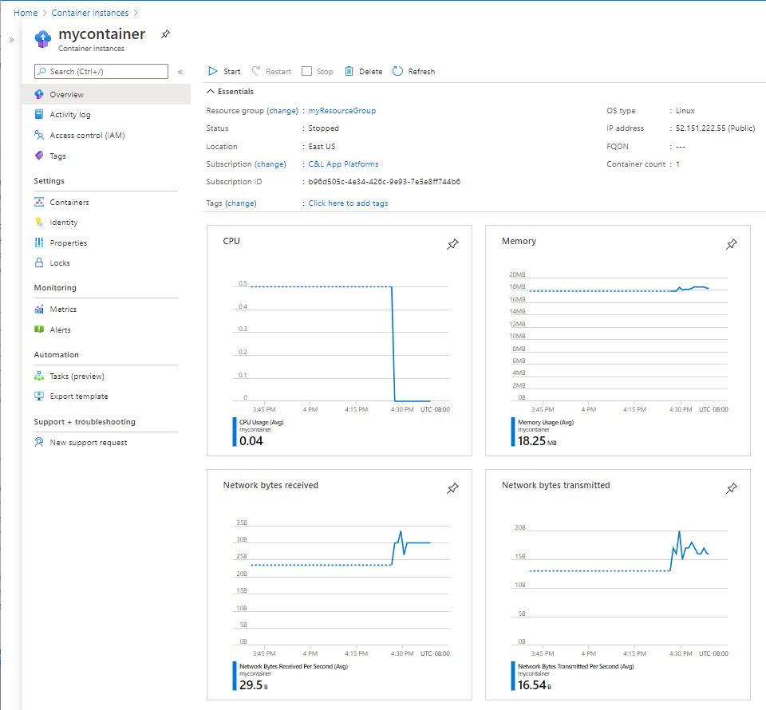

# Azure Container Instance - Workshop

## Menú

- [Conceptos Base](#conceptos-base)
- [Tipo de despliegues en Azure Container Instance](#tipo-de-despliegues-en-azure-container-instance)
  - [Container Groups](#container-groups)
    - [Despliegue de container Groups](#despliegue-de-container-groups)
      - [Despliegue de Container Group usando ARM Templates](#despliegue-de-container-group-usando-arm-templates)
        - [Configuración de plantilla](#configuración-de-plantilla)
        - [Desplegar la plantilla ARM](#desplegar-la-plantilla-arm)
        - [Ver los registros del contenedor (ARM)](#ver-los-registros-del-contenedor-arm)
      - [Despliegue de Container Group usando archivos YAML](#despliegue-de-container-group-usando-archivos-yaml)
        - [Desplegar el grupo de contenedores](#desplegar-el-grupo-de-contenedores)
        - [Estado del despliegue](#estado-del-despliegue)
        - [Ver los registros del contenedor (YAML)](#ver-los-registros-del-contenedor-yaml)

- [Virtual network scenarios](#virtual-network-scenarios)
    - [Escenarios](#escenarios)
    - [Escenarios de red no admitidos](#escenarios-de-red-no-admitidos)
    - [Otras limitaciones](#otras-limitaciones)
    - [Recursos de red requeridos](#recursos-de-red-requeridos)
    - [Desplegar ACI en una red virtual de Azure](#desplegar-aci-en-una-red-virtual-de-azure) 
        - [Requisitos previos](#requisitos-previos)
        - [Desplegar en una nueva red virtual](#desplegar-en-una-nueva-red-virtual)
        - [Desplegar en una red virtual existente](#desplegar-en-una-red-virtual-existente)

- [Monitor Azure Container Instance](#monitor-azure-container-instance)
## Conceptos Base
### ¿Que es Azure Container Instance?

Azure Container Instances (ACI)es un servicio serverless que permite empaquetar, desplegar y gestionar servicios contenerizados sin tener que administrar la infraestructura subyacente. Entre los escenarios comunes que se ejecutan en ACI se incluyen:

- Desarrollo y pruebas de servicios
- Ejecucion de tareas por lotes
- Desplegar aplicaciones de corta duración.
- Automatización de tareas.

Puedes utilizar ACI definiendo los recursos que necesita cada **Container Group**, incluyendo vCPU y memoria. 

ACI es compatible con contenedores del estandar abierto o **Container Group**, soporte a **Container Group** en infraestructuras confidenciales o **Confidential Container Group** y **Spot**. ACI soporta una instancia única o de múltiples instancias mediante **NGroups**, o bien se pueden obtener mayores capacidades de orquestación desplegando pods en tu clúster de **Azure Kubernetes Service (AKS)** a través de **nodos virtuales en ACI**. Para mejorar los tiempos de inicio de los containers, ACI soporta **standby pools.**

### Azure Container Instance Availability zone

Azure Container Instances soporta despliegues zonales para container groups, lo que significa que cada grupo se asigna a una zona de disponibilidad específica. No es posible que un único container group abarque múltiples zonas. Si necesitas cambiar la zona de un container group, deberás eliminarlo y recrearlo en la nueva zona. Para lograr alta disponibilidad a nivel de zona, se recomienda desplegar múltiples container groups en diferentes zonas.

Para poder implementarlo debes contar con:
- Azure CLI 2.30.0 o superior.
- Azure Resource Manager Api 09-01-2021 o superior.

### Soporte para failover zonal

Un grupo de contenedores (container group) se asigna a una única zona de disponibilidad. Como resultado, ese grupo de instancias de contenedores no se verá afectado por una interrupción que ocurra en cualquier otra zona de la misma región.

Sin embargo, si se produce una interrupción en la zona de disponibilidad en la que se encuentra el grupo de contenedores, se espera que todas las instancias dentro de ese grupo experimenten tiempo de inactividad.

Para evitar el tiempo de inactividad de las instancias de contenedores, se recomienda crear un mínimo de dos grupos de contenedores distribuidos en dos zonas de disponibilidad diferentes dentro de una misma región. Esto garantiza que los recursos de contenedores estén operativos siempre que alguna zona en esa región sufra una interrupción.

### Recuperación ante desastres

Cuando una región o centro de datos completo de Azure experimenta tiempo de inactividad, tus servicios mas críticos deben continuar ejecutándose en una región diferente. Las instancias de Azure Container Instances desplegadas con configuración zonal se ejecutan en una zona específica dentro de una región determinada, sin contar con redundancia incorporada. Para evitar la pérdida de ejecución durante fallos a nivel de región, se recomienda desplegar las instancias de contenedores de forma redundante en otras regiones.

## Tipo de despliegues en Azure Container Instance

## Container Groups:

Un **Container Group** es un conjunto de contenedores que se ejecutan en la misma máquina virtual. Los contenedores en un grupo comparten el ciclo de vida, los recursos, la red local y los volúmenes de almacenamiento. Es similar en concepto a un pod en Kubernetes.

El siguiente diagrama muestra un ejemplo de un grupo de contenedores que incluye múltiples contenedores:


Este grupo de contenedores de ejemplo:
- Se aprovisiono en una única máquina virtual.
- Se le asigna un registro de nombre DNS.
- Expone una única dirección IP pública y expone un puerto especifico.
- Consta de dos contenedores. Un contenedor escucha en el puerto 80, mientras que el otro escucha en el puerto 5000.
- Incluye dos volumes de tipo **Azure Files** como montajes de volúmenes, y cada contenedor monta localmente una de estas comparticiones.

**Nota:**
- Los grupos de contenedores múltiples actualmente solo estan soportados para contenedores Linux.
- Para contenedores de Windows, Azure Container Instances solo soporta el despliegue de una única instancia de contenedor. 


## Despliegue de container Groups

Existen dos formas de desplegar un grupo de contenedores múltiples: 
1. Usar una plantilla de Resource Manager 
2. Usar un archivo YAML. 

Se recomienda utilizar una plantilla de Resource Manager (ARM) cuando necesites desplegar otros recursos de servicios de Azure (containers no efimeros, los cuales requieren almacenamiento externo) al desplegar las instancias de contenedores. Debido a la naturaleza más concisa del formato YAML, se recomienda un archivo YAML cuando tu despliegue incluye únicamente instancias de contenedores. Para más detalles sobre las propiedades que puedes configurar, consulta la referencia de la plantilla de Resource Manager o la documentación de referencia YAML.

Para preservar la configuración de un grupo de contenedores, puedes exportar la configuración a un archivo YAML utilizando el comando de Azure CLI az container export. La exportación te permite almacenar las configuraciones de tu grupo de contenedores en un sistema de control de versiones para “configuración como código”, o bien utilizar el archivo exportado como punto de partida para desarrollar una nueva configuración en YAML.

## Despliegue de Container Group usando ARM Templates

**Requisitos previos:**
- Utiliza el entorno Bash en Azure Cloud Shell.
- Si prefieres ejecutar los comandos de referencia de la CLI localmente, instala la Azure CLI. Ejecuta **az version** para conocer la versión y las bibliotecas dependientes instaladas. 
- Inicia sesión en la Azure CLI utilizando el comando az login.

## Configuracion de plantilla

```bash
touch azuredeploy.json
```

2.	Esta plantilla de Resource Manager define un grupo de contenedores con dos contenedores, una dirección IP pública y dos puertos expuestos. El primer contenedor del grupo ejecuta una aplicación web orientada a Internet. El segundo contenedor, el sidecar, realiza una solicitud HTTP a la aplicación web principal a través de la red local del grupo.

```bash
code azuredeploy.json

{
  "$schema": "https://schema.management.azure.com/schemas/2015-01-01/deploymentTemplate.json#",
  "contentVersion": "1.0.0.0",
  "parameters": {
    "containerGroupName": {
      "type": "string",
      "defaultValue": "myContainerGroup",
      "metadata": {
        "description": "Nombre del grupo de contenedores."
      }
    },
    "restartPolicy": {
      "type": "string",
      "defaultValue": "OnFailure",
      "allowedValues": [
        "Always",
        "OnFailure",
        "Never"
      ],
      "metadata": {
        "description": "Política de reinicio para el grupo de contenedores."
      }
    },
    "availabilityZone": {
      "type": "string",
      "defaultValue": "1",
      "metadata": {
        "description": "Zona de disponibilidad en la que se desplegará el grupo de contenedores."
      }
    }
  },
  "variables": {
    "container1name": "aci-tutorial-app",
    "container1image": "mcr.microsoft.com/azuredocs/aci-helloworld:latest"
  },
  "resources": [
    {
      "name": "[parameters('containerGroupName')]",
      "type": "Microsoft.ContainerInstance/containerGroups",
      "apiVersion": "2023-05-01",
      "location": "[resourceGroup().location]",
      "zones": [
        "[parameters('availabilityZone')]"
      ],
      "properties": {
        "restartPolicy": "[parameters('restartPolicy')]",
        "containers": [
          {
            "name": "[variables('container1name')]",
            "properties": {
              "image": "[variables('container1image')]",
              "resources": {
                "requests": {
                  "cpu": 1,
                  "memoryInGb": 1.5
                }
              },
              "ports": [
                {
                  "port": 80
                },
                {
                  "port": 8080
                }
              ]
            }
          }
        ],
        "osType": "Linux",
        "ipAddress": {
          "type": "Public",
          "ports": [
            {
              "protocol": "tcp",
              "port": 80
            },
            {
              "protocol": "tcp",
              "port": 8080
            }
          ]
        }
      }
    }
  ],
  "outputs": {
    "containerIPv4Address": {
      "type": "string",
      "value": "[reference(resourceId('Microsoft.ContainerInstance/containerGroups/', parameters('containerGroupName'))).ipAddress.ip]"
    }
  }
}
```

Nota: Si quisieramos usar un registry privado tendriamos que agregar:

```json
"imageRegistryCredentials": [
  {
    "server": "[parameters('imageRegistryLoginServer')]",
    "username": "[parameters('imageRegistryUsername')]",
    "password": "[parameters('imageRegistryPassword')]"
  }
]
```

## Desplegar la plantilla ARM

1.	Crea un grupo de recursos con el comando az group create:
    ```bash
    az group create --name myResourceGroup --location brazilsouth --tags environment=lab app="Workshop ACI" owner-ops="tec-it operations & infrastructure" owner-dev="tec-it integration & application dev"
    ```

2.	Despliega la plantilla utilizando el comando az deployment group create:
    ```bash 
    az deployment group create --resource-group myResourceGroup --template-file azuredeploy.json
    ```

3. Para ver el estado del despliegue, utiliza el siguiente comando:

    ```bash
    az container show --resource-group myResourceGroup --name myContainerGroup --output table
    ```

nota:
Si deseas ver la aplicación en ejecución, navega a la dirección IP asignada en tu navegador. Por ejemplo, en la salida de este ejemplo la IP es 52.168.26.124:

## Ver los registros del contenedor (ARM)

Para ver la salida de los registros de un contenedor, utiliza el comando az container logs. El argumento --container-name especifica el contenedor del cual se extraerán los registros. En este ejemplo, se especifica el contenedor aci-tutorial-app:

Realizamos un request
```bash
export CONTAINER_INSTANCE_IP=$(az container show --resource-group myResourceGroup --name myContainerGroup --query "ipAddress.ip" --output tsv)
curl $CONTAINER_INSTANCE_IP
```
Para ver los registros del contenedor, ejecuta un comando similar especificando el contenedor aci-tutorial-sidecar:

```bash
az container logs --resource-group myResourceGroup --name myContainerGroup --container-name aci-tutorial-app
```

Salida:
```bash
listening on port 80
::ffff:10.92.0.5 - - [17/Mar/2025:18:12:43 +0000] "GET / HTTP/1.1" 200 1696 "-" "Mozilla/5.0 (Macintosh; Intel Mac OS X 10_15_7) AppleWebKit/537.36 (KHTML, like Gecko) Chrome/134.0.0.0 Safari/537.36"
::ffff:10.92.0.5 - - [17/Mar/2025:18:12:45 +0000] "GET /favicon.ico HTTP/1.1" 404 150 "http://20.124.151.194/" "Mozilla/5.0 (Macintosh; Intel Mac OS X 10_15_7) AppleWebKit/537.36 (KHTML, like Gecko) Chrome/134.0.0.0 Safari/537.36"
::ffff:10.92.0.6 - - [17/Mar/2025:18:17:04 +0000] "GET / HTTP/1.1" 200 1696 "-" "curl/8.7.1"
```

Para relizar llamadas petetitivas cada 3 segundos al container instance
Salida:
```bash
while true; do curl -I $CONTAINER_INSTANCE_IP ; echo ""; sleep 3; done      

HTTP/1.1 200 OK
X-Powered-By: Express
Accept-Ranges: bytes
Cache-Control: public, max-age=0
Last-Modified: Mon, 21 Oct 2024 12:17:29 GMT
ETag: W/"6a0-192af02cba8"
Content-Type: text/html; charset=UTF-8
Content-Length: 1696
Date: Mon, 17 Mar 2025 18:20:07 GMT
Connection: keep-alive
Keep-Alive: timeout=5
```

### Destruccion del Laboratorio 

Para eliminar el laboratorio ejecutar:
```bash
az container delete --resource-group myResourceGroup --name myContainerGroup --yes
```


## Despliegue de Container Group usando archivos YAML

Para desplegar un grupo multi-contenedor con el comando az container create en la Azure CLI, debes especificar la configuración del grupo de contenedores en un archivo YAML y pasar este archivo como parámetro al comando.

1. Creacion del archivos:

```bash
touch deploy-aci.yaml
code deploy-aci.yaml
```
2. Contenido del archivo YAML:

    Este archivo YAML define un grupo de contenedores llamado myContainerGroup, una dirección IP pública y un puerto expuesto publicamente. Los contenedores se despliegan a partir de imágenes públicas de Microsoft. El unico contenedor del grupo ejecuta una aplicación web orientada a Internet.

```bash
code deploy-aci.yaml
```

```yaml
apiVersion: 2023-05-01
location: brazilsouth           # Ajusta la ubicación según corresponda
name: myContainerGroup
zones:
  - "1"                    # Zona de disponibilidad
properties:
  restartPolicy: OnFailure
  containers:
    - name: aci-tutorial-app
      properties:
        image: mcr.microsoft.com/azuredocs/aci-helloworld:latest
        resources:
          requests:
            cpu: 1
            memoryInGb: 1.5
        ports:
          - port: 80
  osType: Linux
  ipAddress:
    type: Public
    ports:
      - protocol: tcp
        port: 80
```

3.	Uso de un registro privado (opcional):

    Para utilizar un registro privado de imágenes de contenedores, añade la propiedad imageRegistryCredentials al grupo de contenedores, con valores adaptados a tu entorno:

```yaml
imageRegistryCredentials:
  - server: imageRegistryLoginServer
    username: imageRegistryUsername
    password: imageRegistryPassword
```

## Desplegar el grupo de contenedores

1.	Crear un grupo de recursos:
    
    Utiliza el siguiente comando para crear un grupo de recursos:

    ```bash
    az group create --name myResourceGroup --location brazilsouth --tags environment=lab app="Workshop ACI" owner-ops="tec-it operations & infrastructure" owner-dev="tec-it integration & application dev"
    ```

2.	Desplegar el grupo de contenedores:
    
    Despliega el grupo de contenedores con el comando az container create, pasando el archivo YAML como argumento:

    ```
    az container create --resource-group myResourceGroup --file deploy-aci.yaml
    ```

    En cuestión de segundos, deberías recibir una respuesta inicial de Azure.

## Ver los registros del contenedor (YAML)

Para ver la salida de los registros de un contenedor, utiliza el comando az container logs. El argumento --container-name especifica el contenedor del cual se extraerán los registros. En este ejemplo, se especifica el contenedor aci-tutorial-app:

Realizamos un request
```bash
export CONTAINER_INSTANCE_IP=$(az container show --resource-group myResourceGroup --name myContainerGroup --query "ipAddress.ip" --output tsv)
curl $CONTAINER_INSTANCE_IP
```
Para ver los registros del contenedor, ejecuta un comando similar especificando el contenedor aci-tutorial-sidecar:

```bash
az container logs --resource-group myResourceGroup --name myContainerGroup --container-name aci-tutorial-app
```

Salida:
```bash
listening on port 80
::ffff:10.92.0.5 - - [17/Mar/2025:18:12:43 +0000] "GET / HTTP/1.1" 200 1696 "-" "Mozilla/5.0 (Macintosh; Intel Mac OS X 10_15_7) AppleWebKit/537.36 (KHTML, like Gecko) Chrome/134.0.0.0 Safari/537.36"
::ffff:10.92.0.5 - - [17/Mar/2025:18:12:45 +0000] "GET /favicon.ico HTTP/1.1" 404 150 "http://20.124.151.194/" "Mozilla/5.0 (Macintosh; Intel Mac OS X 10_15_7) AppleWebKit/537.36 (KHTML, like Gecko) Chrome/134.0.0.0 Safari/537.36"
::ffff:10.92.0.6 - - [17/Mar/2025:18:17:04 +0000] "GET / HTTP/1.1" 200 1696 "-" "curl/8.7.1"
```

Para relizar llamadas petetitivas cada 3 segundos al container instance
Salida:
```bash
while true; do curl -I $CONTAINER_INSTANCE_IP ; echo ""; sleep 3; done      

HTTP/1.1 200 OK
X-Powered-By: Express
Accept-Ranges: bytes
Cache-Control: public, max-age=0
Last-Modified: Mon, 21 Oct 2024 12:17:29 GMT
ETag: W/"6a0-192af02cba8"
Content-Type: text/html; charset=UTF-8
Content-Length: 1696
Date: Mon, 17 Mar 2025 18:20:07 GMT
Connection: keep-alive
Keep-Alive: timeout=5
```

### Destruccion del Laboratorio 

Para eliminar el laboratorio ejecutar:
```bash
az container delete --resource-group myResourceGroup --name myContainerGroup --yes
```

Borrado de Resource Group
```bash
az group delete -n myResourceGroup --yes
```


## Virtual network scenarios

### Escenarios

Los **Container Groups** desplegados en una red virtual de Azure habilitan escenarios como:

- Comunicación directa entre **Container Groups** en la misma subred.  
- PErmitir desde instancias de **Container Groups** a recursos de azure que esten en una red virtual diferente.  
- Habilitar la comunicación de **Container Groups**  a través de una VPN o ExpressRoute.  
- Halitiar la inspeccion de la red para identificar el tráfico saliente que se origina el **Container Groups** .  
- Resolver nombres mediante DNS internos de azure para garanrizar la comunicación con otros recuros asociados a una red virtual, como máquinas virtuales.  
- Utilizar reglas de NSG para controlar el acceso de los contenedores a subredes u otros recursos de red.

---

### Escenarios de red no admitidos

- **Azure Load Balancer**: No se admite colocar un Azure Load Balancer delante de instancias de contenedor en un grupo de contenedores conectado a la red.  
- **Peering de red virtual global**: No se admite el peering global (conexión de redes virtuales en diferentes regiones de Azure).  
- **Dirección IP pública o etiqueta DNS**: Los **Container Groups**  desplegados en una red virtual actualmente no admiten exponer contenedores directamente a internet con una dirección IP pública o un nombre de dominio completamente calificado.  
- **Managed Identity con red virtual en regiones de Azure Government**: No se admite Managed Identity con capacidades de red virtual en regiones de Azure Government.

---

### Otras limitaciones

- La subred que utilices para los grupos de contenedores solo puede contener **Container Groups**. Es decir se debe Eliminar todos los recursos existentes de una subred antes de desplegar grupos de contenedores en ella, o crea una nueva subred.  
- Para desplegar **Container Groups**  en una subred, tanto la subred como el grupo de contenedores deben estar en la misma suscripción de Azure.  
- Los despliegues en una red virtual suelen ser más lentos que el despliegue estándar de instancias de contenedor.  
- No se admiten conexiones salientes al puerto 25 ni al 19390. El puerto 19390 debe abrirse en tu firewall para conectar con ACI desde el portal de Azure cuando los grupos de contenedores están desplegados en redes virtuales.  
- Para las conexiones entrantes, el firewall también debe permitir todas las direcciones IP dentro de la red virtual.  
- Si estás conectando tu **Container Groups** a una cuenta de Azure Storage, debes agregar un **private endpoint** a este recurso.  
- No se admiten direcciones IPv6.  
- Las instancias de contenedor no heredan la configuración de DNS de la red virtual asociada. Debes establecer explícitamente la configuración de DNS para las instancias de contenedor.

---

### Recursos de red requeridos

Hay dos recursos de Azure Virtual Network necesarios para desplegar **Container Groups** en una red virtual: la red virtual en sí y una subred delegada dentro de la red virtual 

- **Red virtual**  
  Una red virtual define el espacio de direcciones en el que creas una o más subredes.

- **Subred (delegada)**  
  Las subredes segmentan la red virtual en espacios de direcciones separados que pueden usar los recursos de Azure que colocas en ellas.  
  La subred que uses para grupos de contenedores solo puede contener grupos de contenedores. Una vez delegada, la subred solo se puede utilizar para grupos de contenedores.

## Desplegar ACI en una red virtual de Azure

### Requisitos previos

### Definir variables de entorno

La vía de despliegue automatizada utiliza las siguientes variables de entorno y nombres de recursos a lo largo de esta guía. Si realizas el proceso manualmente, puedes usar tus propias variables y nombres según prefieras.

### Crear un grupo de recursos

Necesitas un grupo de recursos para administrar todos los recursos utilizados en los siguientes ejemplos. Para crear un grupo de recursos, usa `az group create`:

```bash
export RANDOM_ID="$(openssl rand -hex 3)"
export RESOURCE_GROUP_NAME="myACIResourceGroup$RANDOM_ID"
export LOCATION='brazilsouth'

az group create --name $RESOURCE_GROUP_NAME --location $LOCATION --tags environment=lab app="Workshop ACI" owner-ops="tec-it operations & infrastructure" owner-dev="tec-it integration & application dev"
```
> Nota: Una operación exitosa debería producir una salida similar al siguiente JSON:
```json
{
  "id": "/subscriptions/xxxxxxxx-xxxx-xxxx-xxxx-xxxxxxxxxx/resourceGroups/myACIResourceGroup123abc",
  "location": "brazilsouth",
  "managedBy": null,
  "name": "myACIResourceGroup123",
  "properties": {
    "provisioningState": "Succeeded"
  },
  "tags": null,
  "type": "Microsoft.Resources/resourceGroups"
}
```

## Desplegar en una nueva red virtual

> Nota: Usa minimo un rango de subred /28 para disponer de al menos 1 o más direcciones IP de buffer por cada grupo de contenedores.

Para desplegar en una nueva red virtual y permitir que Azure cree automáticamente los recursos de red, especifica lo siguiente cuando ejecutes az container create:
- Nombre de la red virtual
- Prefijo de dirección de la red virtual en formato CIDR
- Nombre de la subred
- Prefijo de dirección de la subred en formato CIDR

Los prefijos de dirección de la red virtual y de la subred especifican los espacios de direcciones para la red virtual y la subred, respectivamente. Se representan en notación CIDR (Classless Inter-Domain Routing), por ejemplo 10.0.0.0/28.

Una vez que despliegas tu primer **Container Groups** con este método, puedes desplegar otros **Container Groups** en la misma subred especificando los nombres de la red virtual y la subred. Debido a que Azure delega la subred a Azure Container Instances, solo puedes desplegar grupos de contenedores en esa subred.

> Ejemplo: 
El siguiente comando az container create especifica la configuración para una nueva red virtual y subred. Proporciona el nombre de un grupo de recursos que se haya creado en una región donde los despliegues de grupos de contenedores en una red virtual estén disponibles. Este comando despliega el contenedor público de Microsoft aci-helloworld, que ejecuta un pequeño servidor web Node.js sirviendo una página estática. En la siguiente sección, desplegarás un segundo grupo de contenedores en la misma subred y probarás la comunicación entre las dos instancias de contenedor.

```bash
export APP_CONTAINER_NAME="appcontainer"
export VNET_NAME="aci-vnet"
export SUBNET_NAME="aci-subnet"

az container create \
  --name $APP_CONTAINER_NAME \
  --resource-group $RESOURCE_GROUP_NAME \
  --image mcr.microsoft.com/azuredocs/aci-helloworld \
  --vnet $VNET_NAME \
  --vnet-address-prefix 10.0.0.0/16 \
  --subnet $SUBNET_NAME \
  --subnet-address-prefix 10.0.0.0/24 \
  --os-type Linux \
  --cpu 1 \
  --memory 1.5
```

Para ver el estado del despliegue, utiliza el siguiente comando:

```bash
    az container show --resource-group $RESOURCE_GROUP_NAME --name $APP_CONTAINER_NAME --output table
```

Para ver los registros del contenedor, ejecuta un comando similar especificando el contenedor aci-tutorial-sidecar:

```bash
    az container logs --resource-group $RESOURCE_GROUP_NAME --name $APP_CONTAINER_NAME
```


### Desplegar en una red virtual existente

Para desplegar un **Container Groups** en una red virtual existente:
1.	Crea una subred dentro de una red virtual existente, utiliza una subred existente en la que ya se haya desplegado un **Container Groups**o usa una subred existente vacía de otros recursos y configuraciones. La subred que uses para **Container Groups** solo puede contener **Container Groups**. Antes de desplegar un **Container Groups** en una subred, debes delegarla explícitamente antes de aprovisionar. Una vez delegada, la subred solo se puede utilizar para grupos de contenedores. Si intentas desplegar recursos que no sean grupos de contenedores en una subred delegada, la operación fallará.

2.	Despliega un grupo de contenedores con az container create y especifica una de las siguientes opciones:
	•	Nombre de la red virtual y nombre de la subred.
	•	Resource ID de la red virtual y Resource ID de la subred, lo que permite usar una red virtual de un grupo de recursos diferente.

### Desplegar usando un archivo YAML

También puedes desplegar un **Container Groups** en una red virtual existente usando un archivo YAML.

Por ejemplo, al usar un archivo YAML y poder  desplegar en una red virtual con una subred delegada, debes especificar las siguientes propiedades:
- ipAddress: Configuración de dirección IP privada para el grupo de contenedores.
- ports: Puertos que se abrirán (si corresponde).
- protocol: Protocolo (TCP o UDP) para el puerto abierto.
- subnetIds: Resource IDs de las subredes en las que se desplegará.
- id: Resource ID de la subred.
- name: Nombre de la subred.

El siguiente YAML crea un **Container Groups** en tu red virtual existente.

```yaml
apiVersion: '2021-07-01'
location: brazilsouth
name: appcontaineryaml
properties:
  containers:
  - name: appcontaineryaml
    properties:
      image: mcr.microsoft.com/azuredocs/aci-helloworld
      ports:
      - port: 80
        protocol: TCP
      resources:
        requests:
          cpu: 1.0
          memoryInGB: 1.5
  ipAddress:
    type: Private
    ports:
    - protocol: tcp
      port: '80'
  osType: Linux
  restartPolicy: Always
  subnetIds:
    - id: <subnet_id>
      name: default
tags: null
type: Microsoft.ContainerInstance/containerGroups
```
### Aprovisionamiento usando Az CLI
```bash
#!/bin/bash

# Variables de entorno
export RESOURCE_GROUP_NAME='myAciYaml'
export LOCATION='brazilsouth'
export VNET_NAME='myAciYamlVnet'
export SUBNET_NAME='myAciYamlVnetSubnet'
export YAML_APP_CONTAINER_NAME="appcontaineryaml"

# 1. Crear el grupo de recursos
az group create --name $RESOURCE_GROUP_NAME --location $LOCATION --tags environment=lab app="Workshop ACI" owner-ops="tec-it operations & infrastructure" owner-dev="tec-it integration & application dev"

# 2. Crear la VNet y la Subnet
az network vnet create \
  --resource-group $RESOURCE_GROUP_NAME \
  --name $VNET_NAME \
  --address-prefixes 10.0.0.0/8 \
  --subnet-name $SUBNET_NAME \
  --subnet-prefix 10.0.0.0/16

# 3. Delegar la Subnet para Azure Container Instances
az network vnet subnet update \
  --resource-group $RESOURCE_GROUP_NAME \
  --vnet-name $VNET_NAME \
  --name $SUBNET_NAME \
  --delegations "Microsoft.ContainerInstance/containerGroups"

# 4. Obtener el ID de la Subnet
export SUBNET_ID=$(az network vnet subnet show \
  --resource-group $RESOURCE_GROUP_NAME \
  --vnet-name $VNET_NAME \
  --name $SUBNET_NAME \
  --query id --output tsv)

# 5. Generar el archivo YAML en memoria con sustitución de variables
cat <<EOF > container.yaml
apiVersion: '2023-05-01'
location: ${LOCATION}
name: ${YAML_APP_CONTAINER_NAME}
properties:
  containers:
  - name: ${YAML_APP_CONTAINER_NAME}
    properties:
      image: mcr.microsoft.com/azuredocs/aci-helloworld
      ports:
      - port: 80
        protocol: TCP
      resources:
        requests:
          cpu: 1.0
          memoryInGB: 1.5
  ipAddress:
    type: Private
    ports:
    - protocol: tcp
      port: '80'
  osType: Linux
  restartPolicy: Always
  subnetIds:
    - id: ${SUBNET_ID}
      name: default
tags: null
type: Microsoft.ContainerInstance/containerGroups
EOF

# 6. Crear el Container Instance usando el archivo YAML generado
az container create --resource-group $RESOURCE_GROUP_NAME --file container.yaml
```

Para ver el estado del despliegue, utiliza el siguiente comando:

```bash
    az container show --resource-group $RESOURCE_GROUP_NAME --name $YAML_APP_CONTAINER_NAME --output table
```

Para ver los registros del contenedor, ejecuta un comando similar especificando el contenedor aci-tutorial-sidecar:

```bash
    az container logs --resource-group $RESOURCE_GROUP_NAME --name $YAML_APP_CONTAINER_NAME
```

## Monitor Azure Container Instance


> **Nota**  
> Si ya estás familiarizado con este servicio y/o Azure Monitor y solo deseas saber cómo analizar los datos de monitorización, consulta la sección **Analizar** al final de este artículo.

Cuando tienes aplicaciones críticas y procesos de negocio que dependen de los recursos de Azure, necesitas monitorizar y configurar alertas para tu sistema. El servicio Azure Monitor recopila y agrega y registra de cada una de las métricas de tus servicios de azure. Azure Monitor  proporciona una vista de la disponibilidad, rendimiento y resiliencia, y es capaz de notificar cuando surgen problemas. Puedes usar el portal de Azure, PowerShell, Azure CLI, la API REST o SDK's para configurar y ver los datos de monitorización.

Para obtener más información sobre Azure Monitor, consulta [Descripción general de Azure Monitor](https://learn.microsoft.com/azure/azure-monitor/overview).  
Para más información sobre cómo monitorizar recursos de Azure en general, consulta [Monitor Azure resources with Azure Monitor](https://learn.microsoft.com/azure/azure-monitor/).

---

## Tipos de recursos

Azure utiliza el concepto de tipos de recursos e IDs para identificar todo en una suscripción. Los tipos de recursos forman parte del ID de cada recurso en Azure. Por ejemplo, uno de los tipos de recurso para una máquina virtual es `Microsoft.Compute/virtualMachines`. Para obtener una lista de servicios y sus tipos de recurso asociados, consulta [Resource providers](https://learn.microsoft.com/azure/azure-resource-manager/management/azure-services-resource-providers).

Azure Monitor organiza de manera similar los datos de monitorización en métricas y registros basados en tipos de recurso, también llamados *namespaces*. Diferentes métricas y registros están disponibles para distintos tipos de recursos. Tu servicio puede estar asociado a más de un tipo de recurso.

Para más información sobre los tipos de recurso para Azure Container Instances, consulta [Container Instances monitoring data reference](https://learn.microsoft.com/azure/container-instances/container-instances-monitoring).

---

## Almacenamiento de datos

Para Azure Monitor:

- **Métricas:**  
  Los datos de métricas se almacenan en la base de datos de métricas de Azure Monitor.
  
- **Registros:**  
  Los datos de registros se almacenan en el almacén de registros de Azure Monitor. *Log Analytics* es una herramienta en el portal de Azure que permite consultar este almacén.
  
- **Registro de actividad de Azure:**  
  El registro de actividad es un almacén separado con su propia interfaz en el portal de Azure.

Opcionalmente, puedes enrutar los datos de métricas y de registro de actividad al almacén de registros de Azure Monitor. Luego, puedes usar *Log Analytics* para consultar los datos y correlacionarlos con otros registros.

Muchos servicios pueden usar configuraciones de diagnóstico para enviar datos de métricas y registros a otros destinos externos a Azure Monitor, como Azure Storage, Event Hubs, sistemas de socios hospedados y sistemas de socios no-Azure.

Para obtener información detallada sobre cómo Azure Monitor almacena los datos, consulta [Azure Monitor data platform](https://learn.microsoft.com/azure/azure-monitor/essentials/data-platform).

---

## Métricas de plataforma de Azure Monitor

Azure Monitor proporciona métricas de plataforma para la mayoría de los servicios. Estas métricas se caracterizan por:

- Estar definidas individualmente para cada *namespace*.  
- Estar almacenadas en la base de datos de métricas de series temporales de Azure Monitor.  
- Ser ligeras y capaces de soportar alertas casi en tiempo real.  
- Ser utilizadas para rastrear el rendimiento de un recurso a lo largo del tiempo.

**Recopilación:**  
Azure Monitor recopila automáticamente las métricas de plataforma. No se requiere configuración adicional.

**Enrutamiento:**  
También puedes enrutar algunas métricas de plataforma a Azure Monitor Logs / Log Analytics para consultarlas junto con otros registros. Revisa la configuración de exportación para cada métrica y usa una configuración de diagnóstico para enrutar la métrica a Azure Monitor Logs / Log Analytics.

Para más información, consulta [Metrics diagnostic setting](https://learn.microsoft.com/azure/azure-monitor/essentials/diagnostic-settings).

Para configurar configuraciones de diagnóstico para un servicio, consulta [Create diagnostic settings in Azure Monitor](https://learn.microsoft.com/azure/azure-monitor/essentials/diagnostic-settings).

Para una lista de todas las métricas que es posible recopilar para todos los recursos en Azure Monitor, consulta [Supported metrics in Azure Monitor](https://learn.microsoft.com/azure/azure-monitor/platform/metrics-supported).

Para una lista de métricas disponibles para Container Instances, consulta [Container Instances monitoring data reference](https://learn.microsoft.com/azure/container-instances/container-instances-monitoring).

Por defecto, las métricas se agregan como promedios. En un grupo de contenedores con múltiples contenedores, puedes filtrar por la dimensión `containerName` para obtener métricas de un contenedor específico dentro del grupo.

---

## Obtener métricas

Puedes recopilar métricas de Azure Monitor para instancias de contenedores usando el portal de Azure o Azure CLI.

> **Importante**  
> Las métricas de Azure Monitor para Azure Container Instances están en vista previa. Actualmente, solo están disponibles para contenedores Linux. Se ponen a disposición bajo condiciones adicionales de uso. Algunos aspectos de esta función pueden cambiar antes de su disponibilidad general (GA).

### Usar el portal de Azure

Cuando se crea un **Container Name**, los datos de Azure Monitor están disponibles en el portal de Azure. Para ver las métricas de un **Container Name**, ve a la página de **Overview** del grupo. Aquí encontrarás gráficos predefinidos para cada una de las métricas disponibles.

En un grupo con múltiples contenedores, usa una dimensión para mostrar métricas por contenedor. Por ejemplo, selecciona un gráfico de métricas (como CPU), haz clic en **Apply splitting** y selecciona **Container Name**.




### Usar Azure CLI

Primero, obtén el ID del grupo de contenedores usando el siguiente comando (reemplaza `<resource-group>` y `<container-group>` según corresponda):

```bash
CONTAINER_GROUP=$(az container show --resource-group $RESOURCE_GROUP_NAME --name $YAML_APP_CONTAINER_NAME --query id --output tsv)
```

Luego, para obtener métricas de uso de CPU:
```bash
az monitor metrics list --resource $CONTAINER_GROUP --metric CPUUsage --output table
```
Para obtener métricas de uso de memoria:
```bash
az monitor metrics list --resource $CONTAINER_GROUP --metric MemoryUsage --output table
```

En un grupo de contenedores con múltiples contenedores, puedes agregar la dimensión containerName para ver las métricas por contenedor:
```bash
az monitor metrics list --resource $CONTAINER_GROUP --metric MemoryUsage --metric CPUUsage --dimension containerName --output table
```

## Registros de recursos de Azure Monitor

Los registros de recursos proporcionan información sobre las operaciones realizadas por un recurso de Azure. Los registros se generan automáticamente, pero debes enrutar estos registros a Azure Monitor Logs para almacenarlos o consultarlos. Los registros se organizan en categorías; un mismo namespace puede tener múltiples categorías de registros.

**Recopilación:**
Los registros no se recopilan ni almacenan hasta que creas una configuración de diagnóstico y los enrutas a uno o más destinos. Al crear una configuración de diagnóstico, especificas las categorías de registros a recopilar.

**Enrutamiento:**
La opción recomendada es enrutar los registros a Azure Monitor Logs aks Log Analytics para poder consultarlos junto con otros datos de registro. También puedes enviarlos a Azure Storage, Azure Event Hubs y a ciertos socios de monitorización.

Para obtener información detallada sobre la recopilación, el almacenamiento y el enrutamiento de registros, consulta Diagnostic settings in Azure Monitor.

Para una lista de todas las categorías de registros disponibles, consulta Supported resource logs in Azure Monitor.

Los registros de recursos en Azure Monitor tienen un esquema común, seguido de campos específicos del servicio. Para obtener más información sobre cómo obtener datos de registro para Container Instances, consulta Retrieve container logs and events in Azure Container Instances.

---
## Azure activity log

El registro de actividad contiene eventos a nivel de suscripción que registran las operaciones realizadas en cada recurso de Azure, como la creación de un recurso o el inicio de una máquina virtual.
**- Recopilación:**
Los eventos del registro de actividad se generan automáticamente y se almacenan en un almacén separado para su visualización en el portal de Azure.
- Enrutamiento:
Puedes enviar los datos del registro de actividad a Azure Monitor Logs para analizarlos junto con otros datos de registro. También es posible enviarlos a Azure Storage, Event Hubs y a ciertos socios de monitorización.

Para más información sobre cómo enrutar el registro de actividad, consulta Overview of the Azure activity log.

---
## Analizar los datos de monitorización

Existen múltiples herramientas para analizar los datos de monitorización en Azure Monitor:

Herramientas de Azure Monitor
- **Metrics Explorer:**
Herramienta en el portal de Azure que permite visualizar y analizar métricas de los recursos de Azure. Consulta Analyze metrics with Azure Monitor metrics explorer.
- **Log Analytics workspaces:**
Permite consultar y analizar los datos de registro usando el lenguaje de consulta Kusto (KQL). Consulta Get started with log queries in Azure Monitor.
- **Registro de actividad:**
Tiene una interfaz en el portal de Azure para búsquedas básicas. Para análisis más detallados, envía los datos al almacén de Azure Monitor Logs y utiliza Log Analytics.

Otras herramientas avanzadas incluyen:
 - **Dashboards:** Combina diferentes tipos de datos en un solo panel en el portal de Azure.
 - **Workbooks:** Reportes personalizables que pueden incluir texto, métricas y consultas de registro.
 - **Grafana:** Plataforma abierta para crear dashboards operativos con datos de múltiples fuentes.
 - **Power BI:** Servicio de análisis empresarial que permite visualizaciones interactivas; se puede configurar para importar datos de Azure Monitor automáticamente.

## Analizar registros de Container Instances

Puedes usar Log Analytics para analizar y consultar los registros de las instancias de contenedores. También puedes habilitar configuraciones de diagnóstico (en vista previa) en el portal de Azure. Ten en cuenta que Log Analytics y las configuraciones de diagnóstico usan esquemas de tabla ligeramente diferentes.

Consultas en Kusto (KQL)

Puedes analizar los datos de monitorización en el almacén de Log Analytics utilizando el lenguaje de consulta Kusto (KQL). Por ejemplo, la siguiente consulta muestra todas las entradas de registro cuyo campo “Message” contiene la palabra “warn”:

```kusto
ContainerEvent_CL
| where Message contains "warn"
```

Para un grupo de contenedores específico (por ejemplo, “mycontainergroup001”) y entradas generadas en la última hora:
```kusto
ContainerEvent_CL
| where ContainerGroup_s == "mycontainergroup001"
| where TimeGenerated > ago(1h)
```


## Demo de monitoreo

```bash
#!/bin/bash

# Variables de entorno
export RESOURCE_GROUP_NAME='myAciYaml'
export LOCATION='brazilsouth'
export VNET_NAME='myAciYamlVnet'
export SUBNET_NAME='myAciYamlVnetSubnet'
export YAML_APP_CONTAINER_NAME="appcontaineryaml"
export LOG_ANALYTICS_WORKSPACE_NAME="myLogAnalyticsWS"

# 1. Crear el grupo de recursos
az group create --name $RESOURCE_GROUP_NAME --location $LOCATION --tags environment=lab app="Workshop ACI" owner-ops="tec-it operations & infrastructure" owner-dev="tec-it integration & application dev"

# 2. Crear la VNet y la Subnet
az network vnet create \
  --resource-group $RESOURCE_GROUP_NAME \
  --name $VNET_NAME \
  --address-prefixes 10.0.0.0/8 \
  --subnet-name $SUBNET_NAME \
  --subnet-prefix 10.0.0.0/16

# 3. Delegar la Subnet para Azure Container Instances
az network vnet subnet update \
  --resource-group $RESOURCE_GROUP_NAME \
  --vnet-name $VNET_NAME \
  --name $SUBNET_NAME \
  --delegations "Microsoft.ContainerInstance/containerGroups"

# 4. Obtener el ID de la Subnet
export SUBNET_ID=$(az network vnet subnet show \
  --resource-group $RESOURCE_GROUP_NAME \
  --vnet-name $VNET_NAME \
  --name $SUBNET_NAME \
  --query id --output tsv)

# 5. Crear un Log Analytics Workspace
az monitor log-analytics workspace create \
  --resource-group $RESOURCE_GROUP_NAME \
  --workspace-name $LOG_ANALYTICS_WORKSPACE_NAME \
  --location $LOCATION

# 6. Obtener el Workspace ID y la clave compartida
export LOG_ANALYTICS_WORKSPACE_ID=$(az monitor log-analytics workspace show \
  --resource-group $RESOURCE_GROUP_NAME \
  --workspace-name $LOG_ANALYTICS_WORKSPACE_NAME \
  --query customerId --output tsv)

export LOG_ANALYTICS_WORKSPACE_KEY=$(az monitor log-analytics workspace get-shared-keys \
  --resource-group $RESOURCE_GROUP_NAME \
  --workspace-name $LOG_ANALYTICS_WORKSPACE_NAME \
  --query primarySharedKey --output tsv)

# 7. Generar el archivo YAML en memoria con sustitución de variables, incluyendo la configuración de diagnostics
cat <<EOF > container.yaml
apiVersion: '2023-05-01'
location: ${LOCATION}
name: ${YAML_APP_CONTAINER_NAME}
properties:
  containers:
  - name: ${YAML_APP_CONTAINER_NAME}
    properties:
      image: mcr.microsoft.com/azuredocs/aci-helloworld
      ports:
      - port: 80
        protocol: TCP
      resources:
        requests:
          cpu: 1.0
          memoryInGB: 1.5
  ipAddress:
    type: Private
    ports:
    - protocol: tcp
      port: '80'
  osType: Linux
  restartPolicy: Always
  subnetIds:
    - id: ${SUBNET_ID}
      name: default
  diagnostics:
    logAnalytics:
      workspaceId: ${LOG_ANALYTICS_WORKSPACE_ID}
      workspaceKey: ${LOG_ANALYTICS_WORKSPACE_KEY}
tags: null
type: Microsoft.ContainerInstance/containerGroups
EOF

# 8. Crear el Container Instance usando el archivo YAML generado
az container create --resource-group $RESOURCE_GROUP_NAME --file container.yaml

# 9. Verificar el estado del despliegue
az container show --resource-group $RESOURCE_GROUP_NAME --name $YAML_APP_CONTAINER_NAME --output table

# 10. Ver los registros del contenedor
az container logs --resource-group $RESOURCE_GROUP_NAME --name $YAML_APP_CONTAINER_NAME
```